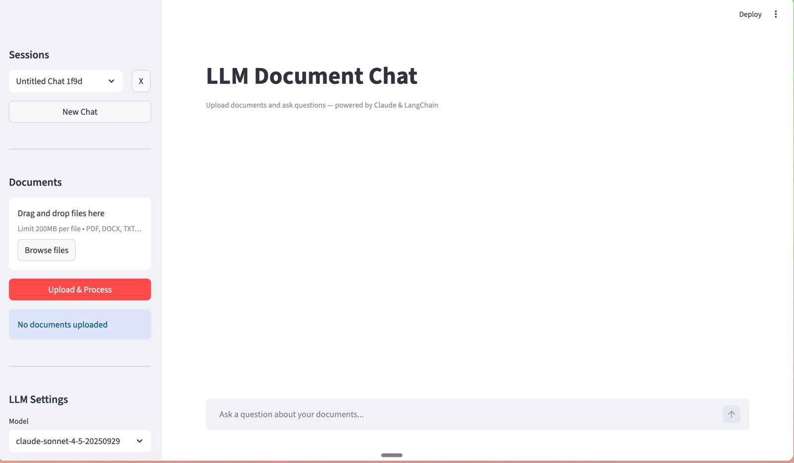
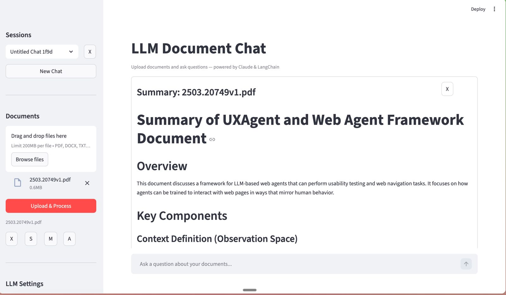

# DocuVerse

Chat with your documents (PDF, DOCX, TXT, Markdown) using Claude and LangChain. Built with FastAPI, Streamlit, and FAISS.

## Display




For more, check out the `demo/` folder.

## Features

- **Multi-format file uploads** - Upload PDF, DOCX, TXT, and Markdown files
- **Summarization** - Generate concise AI summaries of any document
- **Mind map** - Generate interactive mind maps from document content
- **Podcast** - Generate a two-host podcast from any document (via ElevenLabs)
- **Source citations** - See which documents and pages were used to answer each question
- **Adjust LLM Models**  Switch between Claude models and adjust temperature.
- **Export** - Download chat history as Markdown

## Tech Stack

- **Backend** — FastAPI + Uvicorn
- **Frontend** — Streamlit
- **LLM** — Claude (via LangChain + Anthropic)
- **Vector Store** — FAISS
- **Database** — MongoDB (via Beanie ODM)
- **Embeddings** — HuggingFace sentence-transformers
- **Streaming** — SSE (sse-starlette + sseclient-py)
- **Voice** — ElevenLabs (for podcast generation)
- **Package Manager** — [uv](https://docs.astral.sh/uv/)

## Prerequisites

- Python 3.14+
- [uv](https://docs.astral.sh/uv/) package manager
- MongoDB server running locally (or remote)
- Anthropic API key
- ElevenLabs API key (optional, for podcast feature)

## Setup

```sh
uv sync
cp .env.template .env
```

Edit `.env` and fill in your values:

| Variable | Description | Default |
|---|---|---|
| `ANTHROPIC_API_KEY` | Your Anthropic API key | (required) |
| `MONGO_URI` | MongoDB connection string | `mongodb://localhost:27017` |
| `FILES_STORAGE_DIR` | Path to store uploaded files | `../uploaded_files` |
| `ELEVENLABS_API_KEY` | ElevenLabs API key (for podcast) | (optional) |

## Running

Open two terminals from the project root.

**Terminal 1 — Backend:**

```sh
cd server && uv run uvicorn main:app --reload
```

**Terminal 2 — Frontend:**

```sh
cd client && uv run streamlit run app.py
```

Or use the run script to start both at once:

```sh
./run.sh
```

- Backend: http://localhost:8000 (Swagger docs at http://localhost:8000/docs)
- Frontend: http://localhost:8501

## How It Works

1. Upload documents (PDF, DOCX, TXT, MD) through the sidebar
2. Files are chunked, embedded, and stored in FAISS; metadata is saved in MongoDB
3. Create a chat session and ask questions
4. LangChain retrieves relevant chunks and streams Claude's answer back via SSE
5. Source citations show which documents and pages informed each answer


